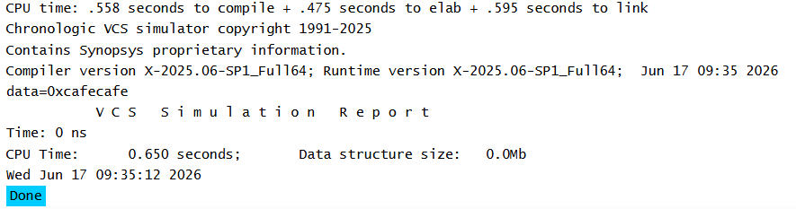

# Abstract Class in SystemVerilog

## Overview

An abstract class is declared using the `virtual` keyword.

```systemverilog
virtual class BaseClass;
```

An abstract class serves as a base class for inheritance and cannot be instantiated directly. It is used to define common properties and behavior that derived classes can inherit.

---

## Key Points

- Declared using the `virtual` keyword.
- Cannot create objects of an abstract class.
- Can contain data members and methods.
- Intended to be extended by derived classes.
- Supports code reuse and hierarchical class design.

---

## Example Concept

In this example:

- `BaseClass` is declared as an abstract class.
- `ChildClass` extends `BaseClass`.
- An object is created only for the derived class.
- The derived class accesses and modifies inherited members.

---

## Simulation Output


---

# Pure Virtual Method in SystemVerilog

## Overview

A pure virtual method is a method declared in an abstract class without an implementation.

```systemverilog
pure virtual function int getData();
```

A class containing one or more pure virtual methods becomes an abstract class and cannot be instantiated directly.

Derived classes must provide an implementation for every pure virtual method.

---

## Key Points

- Declared using the `pure virtual` keyword.
- Does not contain a method body.
- Forces derived classes to implement the method.
- Supports abstraction and polymorphism.
- Ensures a common interface across derived classes.

---

## Example Concept

In this example:

- `BaseClass` declares a pure virtual method `getData()`.
- `ChildClass` extends `BaseClass`.
- `ChildClass` provides the implementation of `getData()`.
- An object is created from the derived class and the implemented method is called.

---

## Simulation Output



---

## Reference

ChipVerify – SystemVerilog Abstract Class

https://chipverify.com/systemverilog/systemverilog-abstract-class