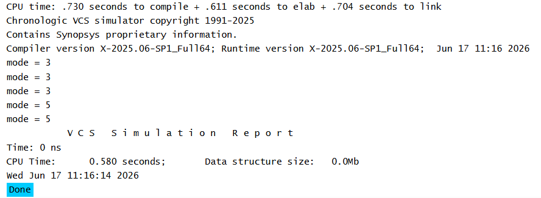
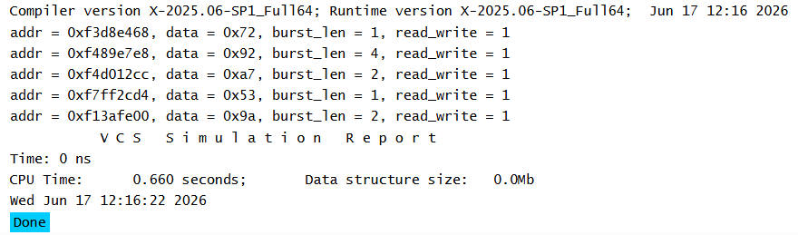
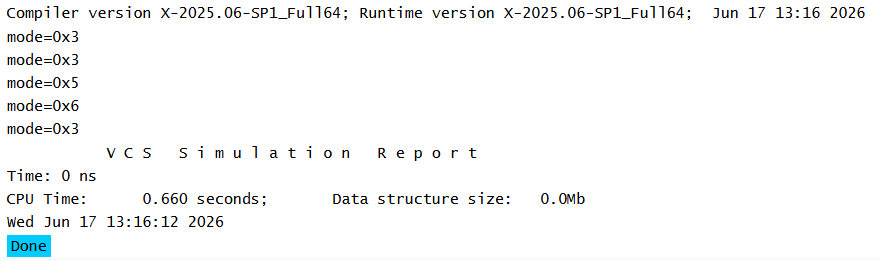

# Constraint Blocks in SystemVerilog

## Overview

A constraint block is used to limit the values that can be assigned to random variables during randomization.

Constraints help generate only valid stimulus by restricting random values to a desired range or condition.

---

## Key Points

- Declared using the `constraint` keyword.
- Applied to variables declared with the `rand` keyword.
- Evaluated automatically during randomization.
- Multiple constraints can be defined within a class.
- If all constraints cannot be satisfied, randomization fails.

---

## Example Concept

In the example:

- `mode` is declared as a random variable.
- A constraint block restricts `mode` to values greater than 2 and less than or equal to 6.
- During randomization, only values within the allowed range are generated.

---

## Learning Outcome

After completing this example, I understood:

- How to declare random variables using `rand`.
- How to create a constraint block.
- How constraints restrict random values.
- How `randomize()` generates values that satisfy all constraints.

---

## Simulation Output



---
# Multiple Constraint Blocks in SystemVerilog

## Overview

A class can contain multiple constraint blocks. During randomization, all active constraints are solved together to generate values that satisfy every constraint.

Multiple constraint blocks improve readability and allow complex requirements to be organized into smaller logical groups.

---

## Key Points

- Multiple constraint blocks can exist in the same class.
- All constraints are solved simultaneously.
- Every generated value must satisfy all active constraints.
- Constraints can be used to control ranges, alignment requirements, dependencies, and legal transaction behavior.

---

## Example Concept

The example demonstrates multiple constraint blocks applied to a bus transaction.

### Address Alignment Constraint

Ensures the address is aligned to a 4-byte boundary.

### Address Range Constraint

Restricts generated addresses to a valid address space.

### Burst Length Constraint

Limits the burst length to a specific range.

### Conditional Constraint

Applies a rule based on another variable's value.

For read transactions:

```text
read_write = 0
```

the data field must be:

```text
data = 0
```

---

## Simulation Output



---

# Extern Constraint Blocks in SystemVerilog

## Overview

SystemVerilog allows constraint blocks to be declared inside a class and defined outside the class using the `extern` keyword.

This approach helps separate class declarations from constraint implementations, improving readability and maintainability.

---

## Key Points

- Constraints can be declared inside a class.
- Constraint definitions can be written outside the class.
- The `extern` keyword is used for external constraint declarations.
- External constraints use the scope resolution operator (`::`) for definition.
- All constraints are applied during randomization.

---

## Example Concept

The example demonstrates:

### Implicit Constraint

A constraint declared in the class and defined outside the class.

### Extern Constraint

A constraint declared using the `extern` keyword and defined outside the class.

Both constraints are applied during randomization.

As a result, generated values satisfy:

```text
mode > 2
mode <= 6
```

---

## Simulation Output



---

## Reference

ChipVerify – SystemVerilog Constraint Blocks

https://chipverify.com/systemverilog/systemverilog-constraint-blocks