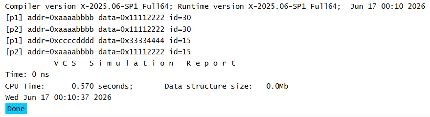
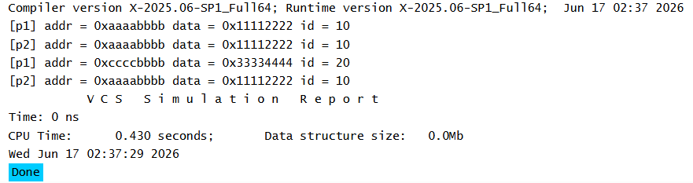

# SystemVerilog Object Copying

## Overview

SystemVerilog supports two types of object copying:

1. Shallow Copy
2. Deep Copy

The difference lies in how nested class objects are handled during the copy operation.

---

# Shallow Copy

## Overview

A shallow copy creates a new object and copies all first-level properties from the source object to the destination object.

When a class contains nested objects, only the object handles are copied. The nested objects themselves are not duplicated.

As a result, both objects share the same nested object instance.

---

## Key Point

- Primitive variables (int, bit, string, etc.) are copied to the new object.
- Nested class objects are **not copied**.
- Only the handles of nested objects are copied.
- Changes made to a shared nested object are visible through both object handles.

---

## Observation

In this example:

- `addr` and `data` belong to the `Packet` object.
- `hdr` is a nested `Header` object.

After performing a shallow copy:

- Modifying `addr` and `data` in one object does not affect the other object.
- Modifying values inside the shared nested object is reflected in both objects.

This happens because both objects reference the same nested object.

---

## Simulation Output

---

# Deep Copy

## Overview

A deep copy creates a completely independent copy of an object.

Unlike a shallow copy, deep copy duplicates the contents of nested objects instead of copying only their handles.

As a result, the source and destination objects do not share any nested object instances.

---

## Key Point

- Primitive variables are copied to the destination object.
- Nested objects are duplicated.
- Source and destination objects become completely independent.
- Changes made to one object do not affect the other.

---

## Observation

In this example:

- `addr` and `data` are copied to the destination object.
- The nested `Header` object is also copied.

After performing a deep copy:

- Modifying the original object's primitive variables does not affect the copied object.
- Modifying the nested object's members also does not affect the copied object.

This happens because each object owns its own independent copy of the nested object.

---

## Simulation Output

---

## Reference

ChipVerify – SystemVerilog Copying Objects

https://chipverify.com/systemverilog/systemverilog-copying-objects
